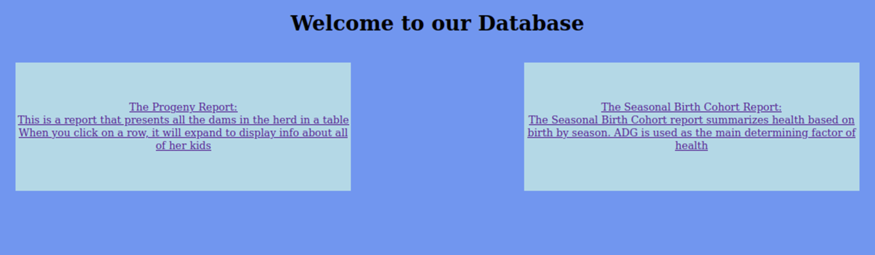

Clone the repository

Open the root directory of the repository in the CLI

Enter the following command:

sh install.sh

This will install the database, populate it with the data, build the project, start the server, and open a firefox window with the landing page, which looks like this:

You can then click on either link to see the report in question.

The Progeny Report:

Once you have loaded the Progeny Report, you can see a dam’s children and their data two separate ways:

1.  Scroll through the report, and when you find the dam whose records you would like to see, click anywhere on that dam’s row.

1.  If you know the tag of the dam whose records you would like to see, enter it in the search bar at the top of the page and click search. This will find the dam (if it exists) and will show her children’s records.

The Birth Cohort Report:

This report provides the average daily gain of goats from birth to maturity across the seasons and months of their birth.

Once you have navigated to this page, clicking on a row will reveal the data from the months of birth that comprise those seasons:

